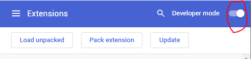
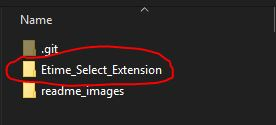
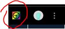

# EtimeSelect

Select the unselectable in DeltekTC etime software!
___

## Installation Instructions

1) Clone this repo `git clone https://github.com/pwolfe8/EtimeSelect`
2) Open Chrome extentions page (enter `chrome://extensions/` in URL)
3) Turn on Developer mode (in upper right-hand corner)  
    
4) Click "Load unpacked" and select the "Etime_Select" folder in this repo  
     
    
5) That's it! You should see the Etime Select logo in your extensions bar  
    

## Try It Out

1) Go to your favorite DeltekTC etime website.
2) While on the timesheet page try selecting those things that were previously unselectable!
3) It should be selectable now! (and copy-pasteable via ctrl+c and ctrl+v or right click menu)

___
Email me with any bugs or additional features you'd like.  
Thanks!  
-Philip
